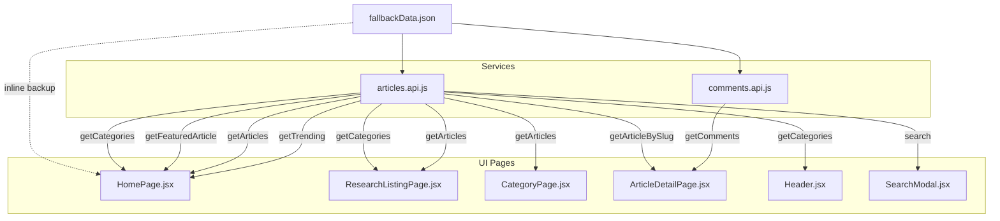

# 14. OFFLINE FALLBACK DATA REGISTRY & DECOUPLING GUIDE

---

## 1. PURPOSE & ARCHITECTURAL OVERVIEW

To support robust local development, high-fidelity UI testing, and zero-blank-screen resilience during temporary backend/database disconnections, Research Factors includes an offline fallback dataset located at:
```
frontend/src/data/fallbackData.json
```

### Absolute Dynamic Precedence Rule
- **Connected (Online)**: When the Node.js/Express backend (`http://localhost:5005/api/v1`) and PostgreSQL database are running, all requests pass directly to the backend. **Live dynamic data is displayed with 100% precedence.**
- **Disconnected (Offline / Network Error)**: If the backend is unreachable (`NETWORK_ERROR`, connection refused, or `!err.response`), the frontend service layer gracefully serves the local fallback JSON without throwing runtime errors or rendering blank screens.

---

## 2. STRICT EVEN-NUMBER RULE

In adherence to project UI design standards and grid symmetry, all collections in the fallback registry strictly maintain **even counts**:

| Collection | Count | Description |
| :--- | :---: | :--- |
| `categories` | **6** | Technology, Business, Science, Economics, Policy, Lifestyle |
| `articles` | **18** | In-depth natural empirical articles across all 6 fields (minimum 3 articles per topic/category) with full BlockRenderer blocks (paragraphs, callouts, tables, quotes) |
| `trendingArticles` | **6** | Ranked 1 to 6 with engagement scores and view counts |
| `comments` | **4** | Top-level peer-review discussions with nested replies |
| `testimonials` | **4** | Editorial reader & CTO testimonials |
| `siteStats` | **4** | Monthly Readers (1.2M+), Articles (500+), Brands (200+), Trust (96%) |

> [!NOTE]
> The **Explore Topics** section in `HomePage.jsx` displays **5 topic cards** (Technology, Business, Lifestyle, Science, Policy) as explicitly pinned by editorial design requirements (`keep it 5`), while the Hero **Trending Today** section displays **6 items** (`make it 6`).

---

## 3. FALLBACK DATA MAPPING REGISTRY

The following table maps each fallback dataset to the service methods, consuming pages, and UI components:



### Detailed Component Inventory

#### 1. `fallbackData.categories` (6 items)
- **Service Interceptor**: `articlesApi.getCategories()`, `articlesApi.getCategoryBySlug(slug)` in [`articles.api.js`](file:///d:/Wizmonk/ResearchFactor/frontend/src/services/articles.api.js).
- **Consuming Views**:
  - `Header.jsx`: Desktop & mobile navigation categories dropdown/bar.
  - `HomePage.jsx`: Category filtering pills in recent research section.
  - `ResearchListingPage.jsx`: Filter sidebar & category badge list.
  - `CategoryPage.jsx`: Category header title, description, and metadata.

#### 2. `fallbackData.articles` (18 items, min 3 per category)
- **Service Interceptor**: `articlesApi.getArticles(params)`, `articlesApi.getFeaturedArticle()`, `articlesApi.getArticleBySlug(slug)`, `articlesApi.search(q)` in [`articles.api.js`](file:///d:/Wizmonk/ResearchFactor/frontend/src/services/articles.api.js).
- **Consuming Views**:
  - `HomePage.jsx`: Featured article hero card, 3-card infinite carousel (`FeaturedArticlesCarousel.jsx`), and article cards.
  - `ResearchListingPage.jsx`: Paginated grid, category filters (`?category=technology`, etc.), type filters.
  - `CategoryPage.jsx`: Filtered grid of articles belonging to selected category.
  - `ArticleDetailPage.jsx`: Full article reading view with rich block rendering.
  - `SearchModal.jsx`: Instant live search results modal.
- **Article Inventory & Asset Mappings**:
  1. *[Technology]* *The Memory Wall in Machine Learning: Why HBM3e, CoWoS Packaging, and Optical Fabrics Cannot Outrun Physics* (`memory-wall-hbm3e-compute-in-memory-hardware-bottlenecks`). Cover: `/images/article_memory_wall.jpg`, Author: Dr. Elena Rostova (`/images/avatar_01.jpg`).
  2. *[Technology]* *The 2-Nanometer GAAFET Transition: Nanosheet Electrostatics, Parasitic Resistance, and Foundry Economics* (`2nm-gaafet-nanosheet-electrostatics-foundry-economics`). Cover: `/images/article_gaafet_2nm.jpg`, Author: Dr. Kenji Takahashi (`/images/avatar_02.jpg`).
  3. *[Technology]* *RISC-V in the Datacenter: Microarchitectural Vector Extensions and the Hyperscaler Custom-Silicon Pivot* (`risc-v-datacenter-microarchitectural-vector-extensions-hyperscaler-custom-silicon`). Cover: `/images/article_riscv_datacenter.jpg`, Author: Dr. Aris Thorne (`/images/avatar_09.jpg`).
  4. *[Business]* *The Real Unit Economics of Cloud Repatriation: An Empirical Audit Across 40 Enterprise Workloads* (`real-unit-economics-cloud-repatriation-datacenter-audit`). Cover: `/images/article_cloud_repatriation.jpg`, Author: Marcus Vance (`/images/avatar_03.jpg`).
  5. *[Business]* *Vertical SaaS Consolidation: Churn Dynamics, Net Revenue Retention, and the Multi-Product Squeeze* (`vertical-saas-consolidation-churn-net-revenue-retention`). Cover: `/images/article_vertical_saas.jpg`, Author: Sarah Lin (`/images/avatar_04.jpg`).
  6. *[Business]* *The Cost of Compute in Frontier AI: Training Clusters, Power Purchase Agreements, and Amortization Schedules* (`cost-of-compute-frontier-ai-clusters-power-purchase-agreements`). Cover: `/images/article_ai_compute_economics.jpg`, Author: Marcus Vance (`/images/avatar_10.jpg`).
  7. *[Science]* *Overcoming the Hepatic Filter: The Biochemical Hurdles of Extrahepatic Lipid Nanoparticle Delivery* (`hepatic-filter-extrahepatic-lipid-nanoparticle-mrna-delivery`). Cover: `/images/article_lnp_delivery.jpg`, Author: Dr. Julian Vance (`/images/avatar_05.jpg`).
  8. *[Science]* *Interface Degradation in High-Nickel Solid-State Batteries: Chemo-Mechanical Stress at the Electrolyte Boundary* (`interface-degradation-high-nickel-solid-state-batteries`). Cover: `/images/article_solid_state_battery.jpg`, Author: Dr. Aris Thorne (`/images/avatar_06.jpg`).
  9. *[Science]* *CRISPR Base and Prime Editing: Resolving Off-Target Cleavage and In Vivo Delivery Selectivity* (`crispr-base-prime-editing-off-target-cleavage-delivery-selectivity`). Cover: `/images/article_crispr_genomics.jpg`, Author: Dr. Miriam O'Connell (`/images/avatar_11.jpg`).
  10. *[Economics]* *The Fragile Monopolies: Extreme Ultraviolet Optics and the Global Lithography Supply Chain* (`fragile-monopolies-extreme-ultraviolet-optics-supply-chain`). Cover: `/images/article_euv_lithography.jpg`, Author: Henrik Lindqvist (`/images/avatar_07.jpg`).
  11. *[Economics]* *The Geopolitics of Critical Minerals: Refined Neodymium, Dysprosium, and Permanent Magnet Supply Vulnerabilities* (`geopolitics-critical-minerals-rare-earth-permanent-magnet-supply`). Cover: `/images/article_critical_minerals.jpg`, Author: Dr. Julian Sterling (`/images/avatar_12.jpg`).
  12. *[Economics]* *Semiconductor Subsidies and Industrial Policy: Evaluating Capital Expenditure Efficiency Across Global Fabs* (`semiconductor-subsidies-industrial-policy-capex-efficiency-global-fabs`). Cover: `/images/article_semiconductor_subsidies.jpg`, Author: Rachel Stern (`/images/avatar_13.jpg`).
  13. *[Policy]* *The EU AI Act and High-Risk Foundation Models: Compliance Verification, Red Teaming, and Statutory Liability* (`eu-ai-act-high-risk-foundation-models-compliance-statutory-liability`). Cover: `/images/article_eu_ai_act.jpg`, Author: Attorney David Chen (`/images/avatar_14.jpg`).
  14. *[Policy]* *Antitrust in Cloud Infrastructure: Egress Fees, Bundled Software Licensing, and Multi-Cloud Portability* (`cloud-infrastructure-antitrust-egress-fees-bundled-licensing-portability`). Cover: `/images/article_cloud_antitrust.jpg`, Author: Sophia Morales (`/images/avatar_15.jpg`).
  15. *[Policy]* *Open Weight Models and National Security: Evaluating Export Controls on Weights, Tooling, and Datasets* (`open-weight-models-national-security-export-controls-tooling`). Cover: `/images/article_open_weights_policy.jpg`, Author: Dr. Kimberly Park (`/images/avatar_16.jpg`).
  16. *[Lifestyle]* *Melanopic Lux and Sleep Architecture: The Photobiological Mechanism of Narrow-Band Circadian Disruption* (`melanopic-lux-circadian-photobiology-sleep-architecture`). Cover: `/images/article_circadian_photobiology.jpg`, Author: Dr. Maya Patel (`/images/avatar_08.jpg`).
  17. *[Lifestyle]* *The Biomechanics of Sedentary Work: Lumbar Disc Intradiscal Pressure, Active Ergonomics, and Spinal Health* (`biomechanics-sedentary-work-lumbar-disc-pressure-active-ergonomics`). Cover: `/images/article_biomechanics_ergonomics.jpg`, Author: Dr. Thomas Lindqvist (`/images/avatar_17.jpg`).
  18. *[Lifestyle]* *Microplastics in the Human Vascular System: Detection Methodologies, Endothelial Penetration, and Cardiovascular Risks* (`microplastics-human-vascular-system-detection-endothelial-penetration`). Cover: `/images/article_vascular_microplastics.jpg`, Author: Dr. Sarah Al-Mansoor (`/images/avatar_18.jpg`).

#### 3. `fallbackData.trendingArticles` (6 items)
- **Service Interceptor**: `articlesApi.getTrending()` in [`articles.api.js`](file:///d:/Wizmonk/ResearchFactor/frontend/src/services/articles.api.js).
- **Consuming Views**:
  - `HomePage.jsx` (Hero Right Column): "Trending Today" numbered 1 through 6 with categories and read times.

#### 4. `fallbackData.comments` (4 items)
- **Service Interceptor**: `commentsApi.getComments(articleId)` in [`comments.api.js`](file:///d:/Wizmonk/ResearchFactor/frontend/src/services/comments.api.js).
- **Consuming Views**:
  - `ArticleDetailPage.jsx`: Peer discussion section beneath article text, with like counters, author titles, and nested replies.

#### 5. `fallbackData.testimonials` (4 items)
- **Direct Usage**: `testimonials` array in [`HomePage.jsx`](file:///d:/Wizmonk/ResearchFactor/frontend/src/pages/public/HomePage.jsx#L280-L300).
- **Consuming Views**:
  - `HomePage.jsx`: Reader Testimonial carousel card with swipe gesture handling and dot pagination.

#### 6. `fallbackData.siteStats` (4 counters)
- **Direct Usage**: Stat counters in [`HomePage.jsx`](file:///d:/Wizmonk/ResearchFactor/frontend/src/pages/public/HomePage.jsx#L988-L1025).
- **Consuming Views**:
  - `HomePage.jsx`: Impact section (Monthly Readers, In-Depth Articles, Partner Brands, Reader Trust).

#### 7. `pagesContent.json` (Legal & Company Pages)
- **Source File**: [`frontend/src/data/pagesContent.json`](file:///d:/Wizmonk/ResearchFactor/frontend/src/data/pagesContent.json).
- **Service Interceptor**: `pagesApi.getPageContent(slug)` & `usePageContent(slug)` in [`pages.api.js`](file:///d:/Wizmonk/ResearchFactor/frontend/src/services/pages.api.js).
- **Consuming Views**:
  - `AboutPage.jsx` (`/about`): Editorial mission, "What We Do", 4 approach pillars, vision, leadership contacts.
  - `TermsPage.jsx` (`/terms`): All 18 clauses from `Requirements/pages.md` with desktop sticky TOC navigation.
  - `PrivacyPolicyPage.jsx` (`/privacy-policy`): All 15 sections from `Requirements/pages.md` with GDPR/CCPA disclosures.
  - `CookiePolicyPage.jsx` (`/cookie-policy`): All 7 sections from `Requirements/pages.md` with browser controls.
- **Future Admin CMS Hook**: When an admin CMS or backend route (`/api/v1/pages/:slug`) is mounted, `pages.api.js` automatically loads database-managed content with zero UI refactoring required.

---

## 4. HOW TO REMOVE / DECOUPLE FALLBACK DATA IN THE FUTURE

When the backend infrastructure is permanently deployed and fallback data is no longer needed, follow these 3 steps to completely decouple it:

### Step 1: Restore `articles.api.js` to Direct API Calls
Open [`frontend/src/services/articles.api.js`](file:///d:/Wizmonk/ResearchFactor/frontend/src/services/articles.api.js) and replace the entire file with:

```javascript
import { apiClient } from './api.client.js';

export const articlesApi = {
  getArticles: (params = {}) => apiClient.get('/articles', { params }),
  getFeaturedArticle: () => apiClient.get('/articles/featured'),
  getTrending: () => apiClient.get('/articles/trending'),
  getArticleBySlug: (slug) => apiClient.get(`/articles/${slug}`),
  getCategories: () => apiClient.get('/categories'),
  getCategoryBySlug: (slug) => apiClient.get(`/categories/${slug}`),
  getTags: (params = {}) => apiClient.get('/tags', { params }),
  getTagBySlug: (slug) => apiClient.get(`/tags/${slug}`),
  search: (q) => apiClient.get('/search', { params: { q } }),

  // Author endpoints
  getMyArticles: () => apiClient.get('/articles/author/me'),
  getDraft: (id) => apiClient.get(`/articles/${id}/draft`),
  createDraft: (data) => apiClient.post('/articles', data),
  updateDraft: (id, data) => apiClient.patch(`/articles/${id}/draft`, data),
  submitForReview: (id) => apiClient.post(`/articles/${id}/submit`),

  // Editorial endpoints
  approveArticle: (id) => apiClient.post(`/articles/${id}/approve`),
  rejectArticle: (id, reason) => apiClient.post(`/articles/${id}/reject`, { reason }),
  publishArticle: (id) => apiClient.post(`/articles/${id}/publish`)
};
```

### Step 2: Restore `comments.api.js` to Direct API Calls
Open [`frontend/src/services/comments.api.js`](file:///d:/Wizmonk/ResearchFactor/frontend/src/services/comments.api.js) and replace the entire file with:

```javascript
import { apiClient } from './api.client.js';

export const commentsApi = {
  getComments: (articleId, params = {}) =>
    apiClient.get(`/articles/${articleId}/comments`, { params }),

  createComment: (articleId, data) =>
    apiClient.post(`/articles/${articleId}/comments`, data),

  toggleLike: (commentId) =>
    apiClient.post(`/comments/${commentId}/like`),

  reportComment: (commentId, data) =>
    apiClient.post(`/comments/${commentId}/report`, data),

  deleteComment: (commentId) =>
    apiClient.delete(`/comments/${commentId}`)
};
```

### Step 3: Delete the Fallback JSON File
Delete the file:
```bash
rm frontend/src/data/fallbackData.json
```

No other files or components require refactoring because all React components already consume data strictly through `articlesApi` and `commentsApi`.
