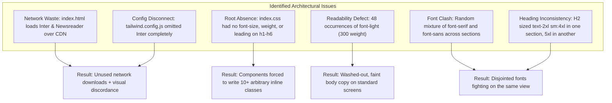

# 15. FRONTEND DESIGN & TYPOGRAPHY SYSTEM

This document serves as the definitive engineering and design reference for the typography, font cascade, heading hierarchy, and CSS structure across the **Research Factors** frontend application.

---

## 1. Production Design Philosophy & Option A Architecture

Research Factors adopts a **Pure Native System UI Architecture (Option A)**. This pattern—used by platforms like GitHub, WordPress Core, and Linear—prioritizes:
1. **Instant First Paint (0ms Font Latency)**: Zero external web font network requests (`fonts.googleapis.com`), eliminating Flash of Unstyled Text (FOUT), Flash of Invisible Text (FOIT), and Cumulative Layout Shift (CLS = 0).
2. **True Native Device Integration**:
   - **macOS / iOS**: Renders Apple's **San Francisco (SF Pro)** via `-apple-system` and `BlinkMacSystemFont`.
   - **Windows**: Renders Microsoft's **Segoe UI** via `system-ui` and `"Segoe UI"`.
   - **Android**: Renders Google's **Roboto** via `system-ui` and `Roboto`.
   - **Linux**: Renders native system sans-serif.
3. **Zero Theme / Color Disruption**: All brand and editorial colors (`rfblue`, `paper`, `ink`, `brand`, `rfred`) remain 100% intact with high contrast in both light and dark modes.

---

## 2. Current Codebase Audit: Identified Issues & Legacy Overrides

Before this architectural standardization, several structural issues existed across the codebase:



### Key Issues Uncovered in the Audit:

1. **Unused External Font Downloads (`index.html`)**:
   `index.html` was loading Google Fonts for `Inter` and `Newsreader`. However, `Inter` was **never included in `tailwind.config.js`**, meaning users were forced to download ~50KB of font data that the browser never rendered.
2. **Premature `system-ui` in the Serif Stack (`tailwind.config.js`)**:
   Because `-apple-system` and `system-ui` were placed before `Newsreader` in `fontFamily.serif`, even elements tagged with `font-serif` were actually rendering in sans-serif (SF Pro on Mac, Segoe UI on Windows).
3. **Missing Root Scale (`index.css`)**:
   In `index.css`, `@layer base` only defined:
   ```css
   h1, h2, h3, h4, h5, h6 {
     @apply tracking-tight text-ink-darkest;
   }
   ```
   No default sizes, font weights, or line-heights were defined at the root. Every component had to reinvent its own arbitrary responsive classes (`text-3xl sm:text-5xl lg:text-6xl`, `leading-[1.12]`, etc.), causing visual fragmentation.
4. **The `font-light` (300 Weight) Contrast Defect**:
   There were **48 explicit instances** of `font-light` scattered across `HomePage.jsx`, `ArticleCard.jsx`, `TermsPage.jsx`, and `PrivacyPolicyPage.jsx`. On Windows ClearType and standard-DPI screens, weight 300 renders faint, pale, and washed-out.
5. **Arbitrary Heading Sizing**:
   - `HomePage` Hero H1 used `text-3xl sm:text-5xl lg:text-6xl leading-[1.12]`
   - `Topics` H2 used `text-2xl sm:text-4xl lg:text-5xl`
   - `Latest Research` H2 used `text-2xl sm:text-4xl` (missing `lg:text-5xl`)
   - `Methodology` H2 used `text-2xl sm:text-4xl`
   - Card titles mixed `font-serif` with `font-sans`

---

## 3. The Production-Grade Typography System (Root-First)

### A. Root Configuration (`tailwind.config.js`)
Both `sans` and `serif` are unified to the native system font stack:

```javascript
fontFamily: {
  sans: ['-apple-system', 'BlinkMacSystemFont', 'system-ui', '"Segoe UI"', 'Roboto', '"Helvetica Neue"', 'Arial', 'sans-serif'],
  serif: ['-apple-system', 'BlinkMacSystemFont', 'system-ui', '"Segoe UI"', 'Roboto', '"Helvetica Neue"', 'Arial', 'sans-serif']
}
```
*Benefit: Any component referencing either `font-sans` or legacy `font-serif` resolves to the identical, uniform native system typeface.*

### B. Global Base Scale (`index.css` `@layer base`)

The root stylesheet enforces clear mathematical proportions without requiring inline utility bloat:

```css
@layer base {
  html {
    font-family: -apple-system, BlinkMacSystemFont, system-ui, "Segoe UI", Roboto, "Helvetica Neue", Arial, sans-serif;
    scroll-behavior: smooth;
    -webkit-font-smoothing: antialiased;
    -moz-osx-font-smoothing: grayscale;
  }

  body {
    font-size: 1rem; /* 16px */
    line-height: 1.625; /* leading-relaxed */
    font-weight: 400; /* Standard 400 regular weight */
    @apply bg-paper text-ink selection:bg-rfblue-100 selection:text-rfblue-900;
  }

  /* Universal Root Headings Scale */
  h1 {
    font-size: clamp(2rem, 3.5vw + 1rem, 3.25rem); /* ~32px to 52px */
    font-weight: 700;
    line-height: 1.15;
    letter-spacing: -0.025em;
    @apply text-ink-darkest;
  }

  h2 {
    font-size: clamp(1.625rem, 2.2vw + 1rem, 2.25rem); /* ~26px to 36px */
    font-weight: 700;
    line-height: 1.25;
    letter-spacing: -0.02em;
    @apply text-ink-darkest;
  }

  h3 {
    font-size: clamp(1.25rem, 1.2vw + 0.8rem, 1.5rem); /* ~20px to 24px */
    font-weight: 600;
    line-height: 1.35;
    letter-spacing: -0.015em;
    @apply text-ink-darkest;
  }

  h4 {
    font-size: 1.125rem; /* 18px */
    font-weight: 600;
    line-height: 1.4;
    letter-spacing: -0.01em;
    @apply text-ink-darkest;
  }

  h5 {
    font-size: 1rem; /* 16px */
    font-weight: 600;
    line-height: 1.45;
    @apply text-ink-darkest;
  }

  h6 {
    font-size: 0.875rem; /* 14px */
    font-weight: 600;
    line-height: 1.5;
    letter-spacing: 0.025em;
    text-transform: uppercase;
    @apply text-ink-muted;
  }

  p {
    font-size: 1rem;
    font-weight: 400; /* Eliminates 300 font-light */
    line-height: 1.625;
    @apply text-ink-muted;
  }
}
```

### C. Standard Semantic Utility Tokens (`index.css` `@layer components`)

| Utility Class | CSS Definition | Usage Pattern |
| :--- | :--- | :--- |
| `.text-eyebrow` | `text-xs font-bold uppercase tracking-wider text-rfblue` | Section overlines, category kicker pills, topic tags |
| `.text-lead` | `text-base sm:text-lg text-ink-muted leading-relaxed font-normal` | Hero subheadings, introductory section descriptions |
| `.text-card-title` | `text-base sm:text-lg font-semibold text-ink-darkest leading-snug tracking-tight` | Article card headlines, topic card titles |
| `.text-caption` | `text-xs sm:text-sm text-ink-light font-normal` | Dates, reading times, author bylaws, photo credits |
| `.text-stat-number`| `text-3xl sm:text-4xl font-bold text-rfblue tracking-tight` | Quantitative metrics, key counters, data callouts |

---

## 4. Complete Page-by-Page Typography Mapping

Below is the exhaustive mapping of how typography is applied across all public and internal views:

### 1. [HomePage.jsx](file:///d:/Wizmonk/ResearchFactor/frontend/src/pages/public/HomePage.jsx)
- **Hero Section**:
  - Eyebrow Badge: `.text-eyebrow` (`Trusted Research. Informed Decisions.`)
  - Headline H1: Global `<h1>` (`Real Research. Smarter Choices.`)
  - Subtext: `.text-lead`
  - Trust Signals: `text-xs sm:text-sm font-medium text-ink`
- **Explore Topics Section**:
  - Eyebrow: `.text-eyebrow` (`Explore Topics`)
  - Header H2: Global `<h2>` (`Dive Into What Interests You`)
  - Subtext: `.text-lead`
  - Topic Cards H3: `.text-card-title`
  - Card Description: `text-xs sm:text-sm text-ink-muted font-normal`
- **Featured Carousel**:
  - Header H2: Global `<h2>`
  - Card Headlines: `.text-card-title`
- **Latest Research & Insights**:
  - Eyebrow: `.text-eyebrow` (`Editorial Library`)
  - Header H2: Global `<h2>` (`Latest Research & Insights`)
  - Subtext: `.text-lead`
  - Articles: Rendered via `ArticleCard` (standard variant)
- **More Than Just Articles (Feature Cards)**:
  - Header H2: Global `<h2>`
  - Feature Cards H3: `.text-card-title`
  - Feature Description: `text-xs sm:text-sm text-ink-muted font-normal`
- **Partnership Section**:
  - Header H2: Global `<h2>` (`Partner With a Platform...`)
  - Paragraph: `.text-lead`
- **Methodology ("From Question to Insight")**:
  - Header H2: Global `<h2>`
  - Step Titles H4: Global `<h4>` (`18px semibold`)
  - Step Body: `text-xs sm:text-sm text-ink-muted font-normal`
- **Credibility & Stats**:
  - Header H2: Global `<h2>` (`Built on Credibility...`)
  - Stat Numbers: `.text-stat-number` (`0.8M+`, `302+`, `104+`, `21%`)
  - Testimonial Quote: `text-sm sm:text-base text-ink-darkest font-normal italic`
- **Newsletter ("Stay Ahead")**:
  - Header H2: Global `<h2>` text-white
  - Subtext: `.text-lead` text-slate-300
- **Bottom Call-to-Action Cards**:
  - Card H3: Global `<h3>` (`text-xl sm:text-2xl font-semibold`)
  - Card Body: `text-sm text-ink-muted font-normal`

---

### 2. [ArticleCard.jsx](file:///d:/Wizmonk/ResearchFactor/frontend/src/components/article/ArticleCard.jsx)
- **Featured Variant (`variant="featured"`)**:
  - Category Badge: `text-xs font-bold uppercase tracking-wider`
  - Metadata: `.text-caption` (Date, reading time)
  - Title H2: `text-lg sm:text-xl lg:text-2xl font-bold leading-snug tracking-tight text-ink-darkest line-clamp-2`
  - Subtitle Deck: `text-sm sm:text-base font-semibold leading-relaxed text-ink-darkest line-clamp-2` (rendered conditionally when present)
  - Excerpt: `text-xs sm:text-sm text-ink-muted font-normal leading-relaxed` with dynamic clamp (`line-clamp-3 sm:line-clamp-4` with subtitle, or `line-clamp-4 sm:line-clamp-5` without)
  - Tags Pill Row: Up to 3 discipline/topic badges (`text-[11px] font-medium bg-slate-100 text-slate-600`)
  - Author: `text-xs sm:text-sm font-semibold text-ink-darkest` with avatar, headline, and direct article link button
- **Standard Variant (`variant="standard"`)**:
  - Category Badge: `text-xs font-bold uppercase tracking-wider`
  - Metadata: `.text-caption`
  - Title H3: `.text-card-title`
  - Excerpt: `text-xs sm:text-sm text-ink-muted font-normal leading-relaxed`
- **Compact Variant (`variant="compact"`)**:
  - Eyebrow: `text-xs font-bold uppercase tracking-wider text-rfblue`
  - Title H4: `text-sm sm:text-base font-semibold leading-snug text-ink-darkest`
- **Related Horizontal (`variant="related-horizontal"`)**:
  - Title H4: `text-sm sm:text-base font-semibold leading-snug text-ink-darkest`

---

### 3. [ArticleDetailPage.jsx](file:///d:/Wizmonk/ResearchFactor/frontend/src/pages/public/ArticleDetailPage.jsx)
- **Header**:
  - Category & Format Pill: `.text-eyebrow`
  - Main Title H1: Global `<h1>` (`font-bold tracking-tight text-ink-darkest`)
  - Subtitle: `.text-lead` (`font-normal leading-relaxed text-ink-muted`)
  - Author Bio & Metadata: `.text-caption`
- **Article Body (`.rich-prose`)**:
  - Headings within article blocks: Proportional `<h2>` and `<h3>`
  - Paragraphs: Standard `1rem (16px)` with `leading-relaxed` (1.75 line-height) for comfortable long-form reading
  - Blockquotes: Italicized `1rem font-normal` with blue accent border

---

### 4. Archive, Taxonomy & Static Pages
- **[ResearchListingPage.jsx](file:///d:/Wizmonk/ResearchFactor/frontend/src/pages/public/ResearchListingPage.jsx)**:
  - Header H1: Global `<h1>` (`Research Archive`)
  - Description: `.text-lead`
- **[CategoryPage.jsx](file:///d:/Wizmonk/ResearchFactor/frontend/src/pages/public/CategoryPage.jsx)**:
  - Category Title H1: Global `<h1>`
  - Description: `.text-lead`
- **[AboutPage.jsx](file:///d:/Wizmonk/ResearchFactor/frontend/src/pages/public/AboutPage.jsx)**, **[ContactPage.jsx](file:///d:/Wizmonk/ResearchFactor/frontend/src/pages/public/ContactPage.jsx)**, **[SponsorshipPage.jsx](file:///d:/Wizmonk/ResearchFactor/frontend/src/pages/public/SponsorshipPage.jsx)**:
  - Page Titles: Global `<h1>`
  - Section Titles: Global `<h2>`
  - Subheadings: Global `<h3>`
  - Body copy: Standard 400 normal weight (no `font-light`)
  - **Contact Page Layout Alignment**: Desktop 2-column grid (`lg:grid-cols-12 items-stretch`) with left direct communication channels and response commitment callout matching the exact vertical height and baseline of the right interactive message form; mobile stacked responsive layout (`space-y-6 lg:space-y-0`).
  - **Editorial Bureau Map**: Full max-width responsive Google Maps embed displaying the centralized bureau location at Bhubaneswar, Odisha, India (`https://maps.google.com/maps?q=Bhubaneswar%2C%20Odisha`) with direct link button and structured `PostalAddress` schema.
- **Legal Pages ([TermsPage.jsx](file:///d:/Wizmonk/ResearchFactor/frontend/src/pages/public/TermsPage.jsx), [PrivacyPolicyPage.jsx](file:///d:/Wizmonk/ResearchFactor/frontend/src/pages/public/PrivacyPolicyPage.jsx), [CookiePolicyPage.jsx](file:///d:/Wizmonk/ResearchFactor/frontend/src/pages/public/CookiePolicyPage.jsx))**:
  - All legal clause blocks converted from `font-light` (300) to standard `font-normal` (400) for strict legal legibility.

---

### 5. Global Search Modal & Header/Footer
- **[SearchModal.jsx](file:///d:/Wizmonk/ResearchFactor/frontend/src/components/search/SearchModal.jsx)**:
  - Input: `text-sm sm:text-base font-normal text-ink`
  - Section Headers ("Recent Searches", "You may like", "Most people reading"): `.text-eyebrow`
  - Result Titles: `text-sm sm:text-base font-semibold leading-snug`
- **[Header.jsx](file:///d:/Wizmonk/ResearchFactor/frontend/src/components/layout/Header.jsx)**:
  - Navigation links: `text-xs sm:text-sm font-semibold tracking-wide text-ink hover:text-rfblue`
- **[Footer.jsx](file:///d:/Wizmonk/ResearchFactor/frontend/src/components/layout/Footer.jsx)**:
  - Footer headings: `text-xs font-bold uppercase tracking-widest text-slate-100 inline-block pb-1.5 border-b-2 border-blue-500`
  - Footer links: `border-l-2 border-transparent hover:border-blue-500 active:border-blue-400 pl-0 hover:pl-2.5 text-slate-300 hover:text-white active:text-blue-200 transition-all duration-200 block py-0.5 text-xs sm:text-sm`
  - Social Brand Buttons: `w-8 h-8 rounded-full text-white flex items-center justify-center hover:scale-110 active:scale-95 transition-all shadow-sm hover:brightness-110` with official brand backgrounds (`#1877F2` Facebook, Instagram gradient, `#1DA1F2` X/Twitter, `#FF0000` YouTube)
  - Trust Verification Badges: `w-10 h-10 rounded-lg flex items-center justify-center shrink-0` color-coded by domain (`emerald` for Verified, `blue` for Analysis, `amber` for User Perspectives)

---

## 5. Summary of Eliminated Legacy Overrides

| Legacy Code / Class Removed | Replacement Architecture | Rationale |
| :--- | :--- | :--- |
| `<link href="...fonts.googleapis.com...">` | **Removed completely from `index.html`** | Eliminates ~50KB unused CDN download, eliminates FOUT/FOIT/CLS. |
| `font-serif` on headings | **Unified to native system stack** | Eliminates clash between serif headlines and sans-serif cards/body. |
| `font-light` on paragraphs (48 places) | **Replaced with `font-normal` (400 weight)** | Fixes pale, washed-out text on standard displays and Windows ClearType. |
| `text-3xl sm:5xl lg:6xl leading-[1.12]` | **Replaced with root `h1` clamp scale** | Ensures all page titles scale proportionally across desktop, tablet, and mobile. |
| Inline `leading-[1.12]`, `leading-tight` | **Defined at root in `index.css`** | Eliminates overlapping text lines and ensures uniform vertical rhythm. |

---

## 6. Verification Checklist

1. **Zero Render-Blocking Font Calls**: Network tab shows 0 requests to `fonts.googleapis.com` or `fonts.gstatic.com`.
2. **Platform Font Verification**:
   - macOS: Inspect element computed font shows `system-ui` / `.AppleSystemUIFont` / `SF Pro`.
   - Windows: Inspect element computed font shows `system-ui` / `Segoe UI`.
   - Android: Inspect element computed font shows `Roboto`.
3. **No Visual Font Clashes**: Headings, cards, subheadings, and body text share the identical native system typeface.
4. **Contrast Integrity**: All body text is rendered at crisp 400 regular weight; no washed-out 300 weight text remains.
5. **Theme & Colors Preserved**: All brand colors (`rfblue`, `ink`, `paper`), dark mode styles, borders, and layouts remain 100% untouched.

---

## 7. Safe Engineering Guide: How to Modify Base Variables & Dependent CSS in the Future

When developing new features or adjusting the design in the future, adhere to this architectural hierarchy to prevent regression, specificity wars, or layout instability.

### 1. Understanding the CSS Cascade Order

The frontend styling stack is organized into five distinct layers of precedence (from lowest to highest specificity):

```
┌────────────────────────────────────────────────────────┐
│ 1. Tailwind Config Theme Tokens (tailwind.config.js)   │  <-- Lowest Specificity (Raw Tokens)
├────────────────────────────────────────────────────────┤
│ 2. CSS @layer base (index.css)                         │  <-- HTML tag defaults (h1-h6, body, p)
├────────────────────────────────────────────────────────┤
│ 3. CSS @layer components (index.css)                   │  <-- Reusable design classes (.text-card-title)
├────────────────────────────────────────────────────────┤
│ 4. Tailwind Utility Classes (JSX className)            │  <-- Element-level overrides (text-center, mt-4)
├────────────────────────────────────────────────────────┤
│ 5. Inline style attribute (style={{ ... }})            │  <-- Highest Specificity (Avoid unless dynamic)
└────────────────────────────────────────────────────────┘
```

#### How the Application Behaves Across Layers:
- **Modifying `tailwind.config.js` (Theme Tokens)**:
  - Affects **all** utility classes globally that reference the modified token (e.g. changing `colors.rfblue[600]` updates every button, badge, link, and border using `text-rfblue-600`, `bg-rfblue-600`, `border-rfblue-600`).
  - **Behavior**: Perfectly uniform application-wide propagation without touching any JSX file.
- **Modifying `@layer base` in `index.css`**:
  - Sets the fallback behavior of raw semantic HTML tags (`<h1>` through `<h6>`, `<p>`, `<body>`).
  - **Behavior**: Any heading or paragraph without explicit inline size utilities automatically adopts the new rule. Elements that have explicit utility classes (e.g., `className="text-4xl"`) will override the base layer because utility classes have higher specificity than `@layer base`.
- **Modifying `@layer components` in `index.css`**:
  - Updates compound semantic typography tokens like `.text-eyebrow`, `.text-lead`, `.text-card-title`, `.text-stat-number`.
  - **Behavior**: Safely adjusts recurring component typography without needing to hunt down hundreds of individual JSX files.
- **Adding ad-hoc utility classes in JSX**:
  - Overrides both `@layer base` and `@layer components`.
  - **Behavior**: If done haphazardly, introduces visual inconsistencies (e.g. different weights, random line heights) across pages.

---

### 2. The 4-Step Safe Approach for Future Modifications

To safely modify any base variable, font, or dependent styling in the future:

#### Step 1: Change Tokens at the Source (Single Source of Truth)
- If modifying **colors, typography stacks, spacing, or breakpoints**, always edit `frontend/tailwind.config.js` first.
- *Example*: To adjust the editorial blue shade, change `colors.rfblue.600: '#1D4ED8'` in `tailwind.config.js`. Do not write custom hex codes in CSS or JSX.

#### Step 2: Update Tag Defaults in `@layer base`
- If modifying the global scale of headings or body text, adjust the mathematical `clamp()` values in `frontend/src/index.css` under `@layer base`.
- *Rule*: Never apply `!important` in `@layer base`. Tailwind utilities are designed to cleanly override `@layer base` when needed.

#### Step 3: Reuse or Create Semantic Component Tokens in `@layer components`
- If creating a new recurring pattern (e.g. author signature, paper abstract callout), add it as a class in `@layer components`:
  ```css
  @layer components {
    .text-abstract {
      @apply text-base font-normal text-ink-muted italic leading-relaxed;
    }
  }
  ```
- *Rule*: Reference existing Tailwind tokens (`text-ink-muted`, `font-normal`) inside `@apply` instead of hardcoding raw CSS values.

#### Step 4: Keep JSX Components Razor-Thin
- In JSX files (`.jsx`), use semantic tags (`<h1>`, `<p>`) or component classes (`.text-card-title`, `.text-lead`).
- Reserve utility classes on JSX elements only for **layout, spacing, and positioning** (`mt-4`, `flex`, `items-center`, `gap-3`), not for overriding fundamental font sizes, font families, or font weights.

---

### 3. Anti-Patterns to Strictly Avoid

1. ❌ **Do NOT use `style={{ ... }}` for typography or colors**: Inline styles bypass Tailwind's purge engine, prevent dark-mode switching, and cannot be overridden by responsive breakpoints.
2. ❌ **Do NOT re-introduce `font-serif` or `font-light` (300 weight)**: Weight 300 causes washed-out text on non-Retina displays. Keep body copy at 400 normal weight.
3. ❌ **Do NOT add external font `<link>` tags in `index.html` without updating `tailwind.config.js` and auditing performance**: External fonts degrade First Contentful Paint (FCP) and introduce Cumulative Layout Shift (CLS).
4. ❌ **Do NOT use `!important` (`!text-red-500`) to force styles**: If a style is not taking effect, inspect the cascade order. Adding `!important` creates specificity debt that is hard to debug.

---

## 6. Article Detail Right Sidebar Hierarchy & Natural Flow

The article detail page (`/rf/research/:slug`) utilizes a 12-column responsive grid layout:
- **Left Column (`lg:col-span-8`)**: Main research manuscript flow (Breadcrumb -> Format -> Title -> Subtitle -> Cover Asset -> Prose Blocks -> Author Bio -> Comments).
- **Right Column (`lg:col-span-4`)**: Desktop editorial sidebar with a strict vertical hierarchy.

### Non-Sticky Natural Flow Architecture
- **Design Decision**: The sidebar does not use `sticky` positioning or internal scrolling (`max-h-[...] overflow-y-auto`).
- **Rationale**: Internal scrollbars inside sidebars create clipping, trap mouse wheels, and hide lower cards. Instead, the sidebar uses `<div className="space-y-6">` with natural document flow, allowing all editorial cards to be visible as the user scrolls down the page.

### Desktop Sidebar Component Order:
1. **Tags Card**:
   - Header: `font-serif text-2xl font-bold text-ink-darkest mb-4`.
   - Content: Normal-form tag pills.
2. **Table of Contents (TOC) Card**:
   - Placed directly beneath the Tags card base.
   - Dynamic IntersectionObserver scrollspy highlighting active section.
3. **Sponsored Disclosure Card** (conditional on `article.isSponsored`):
   - Eyebrow: `SPONSORED` in uppercase bold tracking-widest terracotta accent (`text-[#c25e34] dark:text-[#f87171]`).
   - Sponsor Name: `font-serif text-xl sm:text-2xl font-bold text-ink-darkest`.
   - Sponsor Partnership Statement: `text-xs sm:text-sm text-ink-muted leading-relaxed`.
   - Action Button: "Visit Sponsor" pill button with `rel="noopener noreferrer sponsored"`.
4. **Related Publications Card**:
   - Horizontal publication preview cards.
5. **Sponsorship Opportunity Banner** (Available on all article pages):
   - Displayed on all article publications as the final sidebar item.
   - Elegant dark editorial card (`bg-gradient-to-br from-[#060D1A] via-[#0F172A] to-[#1E3A8A]`) with targeted headline and direct CTA linking to `/sponsorship`.
   - Follows natural document flow without sticky locking, scrolling smoothly alongside the article text. Also mirrors in mobile view before comments.

---

## 7. Normal-Form Topic Tags Specification

Topic tags represent editorial taxonomy categories and must be presented in standard human-readable prose format:

- **Formatting Rules**:
  - **No `#` Hashtag Prefix**: Tags are rendered as clean titles (e.g. `Bhubaneswar land investment`, NOT `#bhubaneswar_land_investment`).
  - **No Raw Underscores or Hyphens**: Slugs are normalized into space-separated words.
  - **Pill Badge Styling**:
    - Light Mode: `bg-[#eef5f6] text-[#0f5466] border border-[#d6e7eb] hover:bg-[#dbebee]`.
    - Dark Mode: `dark:bg-[#152e35] dark:text-[#5eead4] dark:border-[#1e444e] dark:hover:bg-[#1b3d46]`.
    - Dimensions: `px-3.5 py-1.5 rounded-full text-xs sm:text-[13px] font-medium shadow-2xs`.
- **Responsive Handling**:
  - Desktop (`>= 1024px`): Featured prominently in the top right sidebar card.
  - Mobile (`< 1024px`): Displayed at the base of the article prose blocks before author biography.

---

## 8. Brand Sponsorship & Commercial Underwriting Pattern

For sponsored research publications, editorial transparency and FTC/regulatory compliance require explicit disclosures:

- **Database Model**: `Article` model attributes `isSponsored` (`Boolean`), `sponsorName` (`String?`), `sponsorDescription` (`String?`), `sponsorUrl` (`String?`), and `sponsorLogoUrl` (`String?`).
- **Author Editor Interface**:
  - Dedicated card with toggle switch: *"This article is sponsored or commercially underwritten"*.
  - Strict **No-Placeholder Rule**: Inputs use clean labels and helper text without placeholder attributes.
  - Live sidebar simulation card reflecting real-time sponsor inputs.
- **Public Rendering**:
  - Displayed prominently in the desktop sidebar between Table of Contents and Related Articles.
  - Displayed in the main column on mobile viewports.
  - Action link enforces `rel="noopener noreferrer sponsored"` for SEO compliance.

---

## 9. Admin Toolbar & Filter Button Pattern

To maximize vertical viewport efficiency and maintain consistent UX across administrative workspaces:

- **Article Management Toolbar Specification (`ArticleManagementPage.jsx`)**:
  - Structured as a high-density, ergonomic control surface:
    - **Primary Flexible Search (`flex-1 min-w-[280px]`)**: Search bar takes the dominant flexible space with standard `text-sm font-normal` sizing (14px) and an inline clear button (`X`).
    - **Controls Group (`flex flex-wrap items-center gap-3 shrink-0`)**: Keeps dropdowns and action buttons grouped together and strictly constrained to their natural widths without stretching across the layout.
    - **Category Taxonomy Filter (`min-w-[170px] sm:min-w-[190px]`)**: Populated via `adminApi.getAllCategories()`, displaying active categories and tagging deactivated taxonomies with `(Inactive)` to facilitate administrative curation.
    - **Lifecycle Status Filter (`min-w-[170px] sm:min-w-[190px]`)**: Compact select supporting all article stages (*Published, Pending Review, Approved / Scheduled, Draft, Needs Revision / Rejected, Archived*).
    - **Reset Action**: Dynamic `Reset` button (`RotateCcw` icon) that appears whenever any filter (`search`, `statusFilter`, `categoryFilter`) is active, resetting all filters and pagination back to page 1.
    - **Contextual Empty State**: When active filters produce zero results, an actionable empty state displays with a direct "Clear All Filters" button.

---

## 10. Universal Confirmation & Alert Modal System

To deliver an elite, editorial experience and eliminate native browser alert/confirm interruptions:

- **Core Abstraction Layer (`ConfirmationModal.jsx` & `ModalContext.jsx`)**:
  - **`useConfirm()` Hook**:
    - Returns a `Promise<boolean>`: `const ok = await confirm({ title, message, confirmText, cancelText, variant, customIcon })`.
    - Resolves `true` when confirmed, `false` on cancel/escape/backdrop click.
  - **`useAlert()` Hook**:
    - Returns a `Promise<void>`: `await showAlert({ title, message, confirmText, variant, customIcon })`.
    - Renders a single acknowledgment button with no cancellation option.
- **Visual Design & Centered Split-Grid Architecture**:
  - **Backdrop**: Smooth dark blur (`fixed inset-0 bg-slate-900/60 dark:bg-slate-950/80 backdrop-blur-xs z-50`).
  - **Dialog Surface**: Centered editorial surface (`bg-white dark:bg-slate-900 rounded-2xl shadow-2xl border border-slate-200 dark:border-slate-800 max-w-sm sm:max-w-[390px] w-full overflow-hidden`).
  - **Upper Body (Centered Flow)**:
    - Padded layout (`pt-7 pb-6 px-6 text-center flex flex-col items-center`).
    - **Centered Circular Icon Badge**: Large circular pill (`w-14 h-14 sm:w-16 sm:h-16 rounded-full flex items-center justify-center border mx-auto mb-4`) with theme-tailored background and border tints.
    - **Centered Headline**: `text-lg sm:text-xl font-bold text-slate-900 dark:text-white tracking-tight mb-2 leading-snug`.
    - **Centered Message Description**: `text-xs sm:text-sm text-slate-500 dark:text-slate-400 leading-relaxed max-w-[320px] mx-auto`.
  - **Lower Footer (Full-Bleed Action Grid)**:
    - Continuous horizontal boundary: `border-t border-slate-200 dark:border-slate-800 bg-slate-50/50 dark:bg-slate-900/50`.
    - **Confirmation Mode**: Two full-bleed buttons in a 50/50 grid (`grid grid-cols-2 divide-x divide-slate-200 dark:divide-slate-800`).
      - Left ("No" / Cancel): `w-full py-3.5 sm:py-4 px-4 text-sm font-semibold text-slate-700 dark:text-slate-300 hover:bg-slate-100 dark:hover:bg-slate-800/80 active:bg-slate-200`.
      - Right (Confirm): `w-full py-3.5 sm:py-4 px-4 text-sm font-semibold flex items-center justify-center gap-1.5 transition-colors` with theme-accented text colors (e.g. `text-red-600 dark:text-red-400 hover:bg-red-50 dark:hover:bg-red-950/40 font-bold`).
    - **Alert Mode**: Single full-width button spanning `w-full py-3.5 sm:py-4 text-sm font-semibold text-center`.
  - **Severity Variants**:
    - `danger`: Red circular badge (`bg-red-50 dark:bg-red-950/60 border-red-200 dark:border-red-900/60 text-red-600 dark:text-red-400`) + red action text (`text-red-600 dark:text-red-400`).
    - `warning`: Amber circular badge (`bg-amber-50 dark:bg-amber-950/60 border-amber-200 dark:border-amber-900/60 text-amber-600 dark:text-amber-400`) + amber action text (`text-amber-600 dark:text-amber-400`).
    - `info`: Blue circular badge (`bg-blue-50 dark:bg-blue-950/60 border-blue-200 dark:border-blue-900/60 text-blue-600 dark:text-blue-400`) + blue action text (`text-blue-600 dark:text-blue-400`).
    - `success`: Emerald circular badge (`bg-emerald-50 dark:bg-emerald-950/60 border-emerald-200 dark:border-emerald-900/60 text-emerald-600 dark:text-emerald-400`) + emerald action text (`text-emerald-600 dark:text-emerald-400`).
- **Smooth Opening & Closing Animations (`AnimatePresence`)**:
  - Backdrop fades smoothly on enter (`opacity: 0 -> 1`) and exit (`opacity: 1 -> 0`) over 200ms.
  - Modal surface executes a fluid spring scale/pop on enter (`scale: 0.94 -> 1, y: 10 -> 0`) and graceful fade/drop on exit (`scale: 1 -> 0.94, y: 0 -> 10, opacity: 1 -> 0`) using cubic bezier easing (`[0.16, 1, 0.3, 1]`, duration: 220ms).
- **Accessibility & Focus**:
  - Implements `role="dialog"` and `aria-modal="true"`.
  - Auto-focuses the primary action button after entrance animation begins.
  - Automatically captures `Escape` key events to smoothly dismiss.

---

## 11. Multi-Select & Bulk Operations Architecture

To enable high-throughput administrative moderation and editorial governance across `/rf/admin/users`, `/rf/admin/articles`, and `/rf/admin/contact-messages`:

### 1. Selection State Management & Master Checkboxes
- **State Pattern**: Independent selection arrays (`selectedUserIds`, `selectedArticleIds`, `selectedMessageIds`) coupled with fast toggle helpers (`toggleSelectAll`, `toggleSelectOne`).
- **Master Header Checkbox (`<th>` / List Header)**:
  - Controlled checkbox reflecting full page selection (`checked={items.length > 0 && selectedIds.length === items.length}`).
  - Accessible label/title (`title="Select all on this page"`).
- **Row & Card Checkboxes**:
  - Placed in the leading column (`w-10 text-center` in tables) or message metadata row.
  - Event propagation isolation (`e.stopPropagation()`) prevents row clicks from inadvertently toggling checkboxes or opening modal views.
- **Row Selection Visual Feedback**:
  - Selected table rows receive a distinct accent highlight: `bg-blue-50/70 dark:bg-blue-900/20`.

### 2. Floating / Contextual Bulk Action Bars
- Renders dynamically whenever `selectedIds.length > 0` with entry micro-animation (`animate-in fade-in duration-150`).
- **Counter Badge**: Highlights selected count with high-contrast pill (`bg-blue-600 text-white rounded-full`).
- **Action Buttons**:
  - **Activate / Publish**: Emerald accent (`bg-emerald-600 hover:bg-emerald-500 text-white`).
  - **Suspend / Archive**: Amber / Red accent with semantic icons (`Ban`, `Archive`).
  - **Permanent Deletion**: Red warning accent (`bg-red-600 hover:bg-red-500 text-white`).
  - **Deselect All**: Ghost button quickly clearing the selection array.
- **Safety Guarantee via `useConfirm()`**:
  - All irreversible bulk actions (suspension, unpublishing, permanent purging) trigger the universal modal confirmation system with clear consequence descriptions before mutation dispatch.

### 3. Header Action Responsive Card & Theme Token Compliance
- **Zero Hardcoded Themes**:
  - Controls like the **Public Signup Toggle** on `/rf/admin/users` strictly adhere to light and dark theme context.
  - Container token: `bg-white dark:bg-slate-800/80 border border-slate-200 dark:border-slate-700/70 shadow-2xs`.
  - Text tokens: `text-slate-600 dark:text-slate-300`, with high-contrast state labels (`text-emerald-600 dark:text-emerald-400` / `text-amber-600 dark:text-amber-400`).
  - Switch track: `allowRegistration ? 'bg-emerald-600' : 'bg-slate-300 dark:bg-slate-700'`.
- **Mobile Fluidity**:
  - Top header action bars use `flex-col sm:flex-row items-stretch sm:items-center gap-2.5 sm:gap-3` ensuring comfortable touch targets on mobile viewports without overflowing horizontal borders.

### 4. Alert & Feedback Banner Theme Token Compliance
- **The Problem**: Raw `text-emerald-300` or `text-red-300` without a dark mode prefix renders pastel-tinted text on white/light paper surfaces, causing severe contrast degradation and WCAG accessibility failures.
- **The Solution**: All inline feedback and alert banners must use theme-dual tokens:
  - **Success / Positive**:
    - Surface: `bg-emerald-50 dark:bg-emerald-950/40`
    - Text: `text-emerald-800 dark:text-emerald-300`
    - Border: `border-emerald-200 dark:border-emerald-800/60`
  - **Error / Danger**:
    - Surface: `bg-red-50 dark:bg-red-950/40`
    - Text: `text-red-800 dark:text-red-300`
    - Border: `border-red-200 dark:border-red-800/60`
  - **Warning / Notice**:
    - Surface: `bg-amber-50 dark:bg-amber-950/40`
    - Text: `text-amber-900 dark:text-amber-200`
    - Border: `border-amber-200 dark:border-amber-800/60`
  - **Dismiss Trigger (`X`)**:
    - `p-1 opacity-70 hover:opacity-100 transition-opacity` ensures natural contrast matching the parent container's active text color in any theme.


