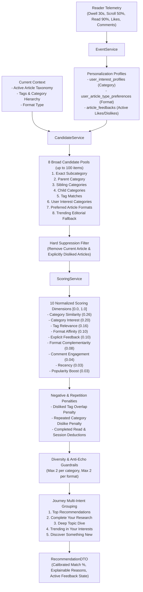

# 16. RECOMMENDATION ENGINE & MULTI-DIMENSIONAL PERSONALIZATION

## 1. System Philosophy & Objectives

The Research Factors recommendation engine answers a singular, foundational question:
> *"If this reader is exploring this article right now, what other research would they find most valuable and intellectually enriching next?"*

Rather than relying purely on blunt "same category" matching, the engine evaluates both:
1. **User Long-Term Profile**: Explicit likes/dislikes, learned category affinities, preferred article formats (`RESEARCH`, `REVIEW`, `COMPARISON`, `GUIDE`, `ANALYSIS`, `OPINION`), and verified discussion engagement.
2. **Current Reading Context**: Hierarchical taxonomy similarity (exact subcategory, sibling, child, parent), semantic tag co-occurrence (Jaccard + Overlap), and cross-format logical research complementarity.
3. **Safety & Quality Invariants**: Hard exclusion of disliked articles, conservative negative penalties without overreacting, and anti-echo-chamber diversity limits.

---

## 2. Recommendation Architecture Pipeline

---

## 3. Data Models & Uniqueness Guarantees

### A. ArticleFeedback (`article_feedbacks`)
Maintains the single active feedback state per identity:
* `canonicalId`: `"usr:<userId>"` for authenticated users; `"vis:<visitorId>"` for anonymous visitors.
* `feedbackType`: `LIKE` | `DISLIKE`.
* `@@unique([canonicalId, articleId])`: Guarantees zero duplicate active rows and eliminates multi-null unique index collisions across all PostgreSQL variants.

### B. UserArticleTypePreference (`user_article_type_preferences`)
Tracks learned format preferences across all 6 platform article types:
* `positiveScore`: Incremented by likes (+2.0), completed reads (+1.0), and comments (+1.0).
* `negativeScore`: Incremented by explicit dislikes (+1.0).
* Decays exponentially with a 30-day half-life:
  $$\text{decay} = \exp\left(-\frac{\ln 2}{30} \times \text{days}\right)$$
* Normalized type affinity:
  $$\text{affinity} = \text{clamp}\left(0.5 + 0.1 \times (\text{positive} - \text{negative}), 0.0, 1.0\right)$$

---

## 4. Multi-Dimensional Scoring Model

All scoring functions strictly output a float in $[0.0, 1.0]$. The base weighted score is:

$$\text{Score}_{\text{base}} = \sum_{i} (w_i \times s_i)$$

| Dimension | Default Weight | Description |
| :--- | :---: | :--- |
| `category` | 0.26 | Exact subcategory (1.0), Sibling (0.75), Child (0.70), Parent (0.65), Unrelated (0.0). |
| `interest` | 0.20 | Decayed historical category affinity from `UserInterestProfile`. |
| `tag` | 0.16 | Blended metric: $0.6 \times \text{Jaccard} + 0.4 \times \text{Overlap}$. |
| `articleTypeAffinity`| 0.10 | Learned format preference vector from `UserArticleTypePreference`. |
| `explicitFeedback` | 0.10 | Topic and tag convergence with reader's liked research. |
| `complementarity` | 0.08 | Reading transitions (REVIEW $\to$ COMPARISON, RESEARCH $\to$ ANALYSIS, etc.). Suppressed if user strongly dislikes the format. |
| `commentAffinity` | 0.04 | Engagement signal derived from verified discussions. |
| `recency` | 0.03 | Freshness exponential decay (14-day half-life). |
| `popularity` | 0.03 | Logarithmic view boost: $\min\left(\frac{\log_{10}(\text{views} + 1)}{5.0}, 1.0\right)$. |

### Negative Penalties & Suppression
1. **Hard Suppression**: An explicitly disliked article is filtered out at candidate generation and is **never** recommended.
2. **Disliked Tag Penalty**: Candidates sharing tags with disliked articles receive a soft penalty between $-0.04$ and $-0.12$.
3. **Repeated Category Dislike Penalty**: If a reader dislikes $\ge 3$ articles in a category without offsetting likes, candidates in that category receive a $-0.10$ penalty.
4. **Already Read Deductions**: Completed reads receive a $0.25\times$ multiplier; same-session reads receive a $0.60\times$ multiplier.

### Match Percentage Calibration
Replaces legacy inflated 95-99% ranges with a realistic, informative distribution:
$$\text{Match \%} = \text{round}(62 + \text{finalScore} \times 34)$$
Ranges from ~65% for adjacent serendipitous discoveries up to 96% for perfect multi-dimensional matches.

---

## 5. Journey Classifications Preserved

1. **Top Matches**: Subcategory-priority recommendations combining exact subcategory and domain family items.
2. **Complete Your Research**: Cross-format articles (`candidate.type != currentArticle.type`) with strong topical relevance (score $\ge 0.25$).
3. **Deep Topic Dive**: Deepens the exact subcategory or shares core research tags.
4. **Trending in Your Interests**: High-velocity and featured articles aligned with the reader's interest categories and format preferences.
5. **Discover Something New**: Anti-echo chamber discoveries in adjacent categories with controlled diversity.

---

## 6. Anonymous-to-Authenticated Identity Merging

When an anonymous reader logs in or registers:
1. `POST /api/v1/recommendations/sync-visitor` is automatically invoked by `AuthContext`.
2. Existing anonymous `article_feedbacks` are reassigned to `usr:<userId>` (user's existing authenticated feedback takes precedence).
3. `user_article_type_preferences` positive and negative scores are aggregated.
4. `user_events` are associated with the authenticated user ID.

---

## 7. Roadmap & Future Enhancements

The following roadmap items are tracked for future releases:
1. **Embedding-Based Semantic Retrieval**: Integrate pgvector with lightweight open-source sentence embeddings (e.g. `all-MiniLM-L6-v2`) to complement lexical tag Jaccard matching with dense semantic similarity.
2. **Reading Speed & Dwell Calibration**: Scale reading completion signals dynamically against article word count and estimated reading time min.
3. **Collaborative Filtering Co-Occurrence**: Batch-compute item-item co-occurrence matrices (*"Readers who liked this also engaged with..."*) periodically via offline cron tasks.
